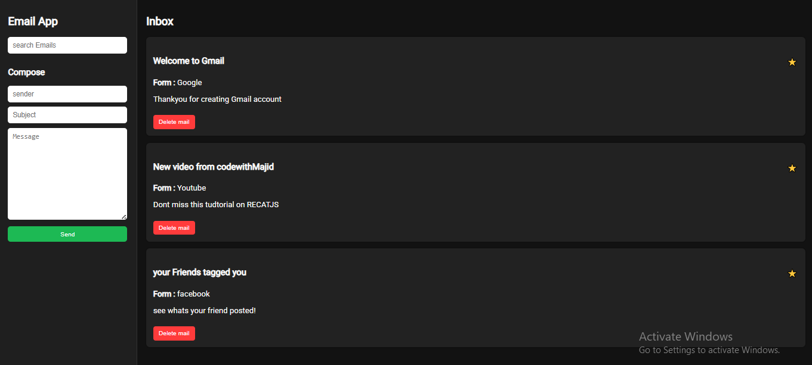

# 📧 React E-Mail App

A simple and functional email client built with **React**. This app features an intuitive UI and core email functionalities including composing emails, searching through messages, and browsing your inbox — all organized in a clean, sidebar layout.



## ✨ Features

- **Compose Email**: Create and send messages with a sleek and responsive compose interface.
- **Search Messages**: Easily search through your emails using the built-in search functionality.
- **Sidebar Navigation**: Quickly access different sections like Inbox through the left sidebar.
- **Inbox View**: Display received emails in an organized, scrollable list.
- **Responsive Design**: Works across desktop and mobile screens.

## 📁 Project Structure


├── public/<br/>
│   └── <br/>
├── src/<br/>
│   ├── components/<br/>
│   │   ├── ComposeEmail.js<br/>
│   │   ├── Inbox.js<br/>
│   │   ├── Sidebar.js<br/>
│   │   └── SearchBar.js<br/>
│   ├── App.js<br/>
│   ├── index.js<br/>
│   └── styles/<br/>
└── README.md<br/>
- 🚀 Getting Started
- Prerequisites
- Make sure you have the following installed:
```bash
- Node.js >= 14.x

- npm or yarn

- Installation


# Clone the repository
git clone https://github.com/your-username/react-email-app.git
cd react-email-app

# Install dependencies
npm install
# or
yarn install

npm start
# or
yarn start
```
- Author Majid ali